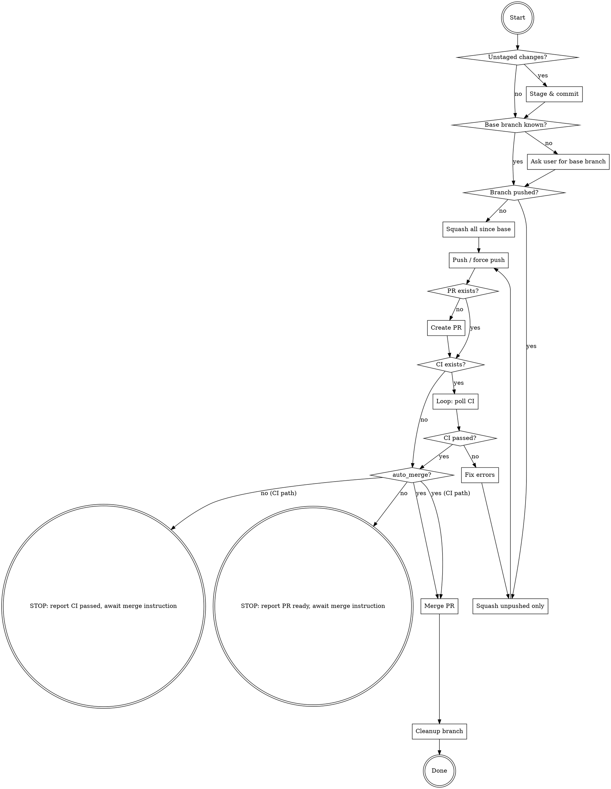

# Ship Branch

Full workflow: commit → squash → push → PR → CI → stop. **Do not merge unless explicitly asked.**

If the user invoked this skill with "merge" (e.g. `/ship-branch merge` or "ship branch and merge"), set `auto_merge=true` and do **not** stop after CI — continue straight through merge and cleanup without asking.



## Commands

**Stage & commit:**

```bash
git add -A && git commit -m "<message>"
```

**Squash — not yet pushed:**

```bash
git reset --soft "$(git merge-base HEAD <base-branch>)"
git commit -m "<message>"
git push -u origin <branch>
```

**Squash — already pushed:**

```bash
git reset --soft "HEAD~$(git rev-list --count origin/<branch>..HEAD)"
git commit -m "<message>"
git push --force-with-lease
```

**Create PR:**

```bash
gh pr create --base <base-branch> --title "<title>" --body "<body>"
```

**Poll CI — use /loop (dynamic, no interval):**

Invoke the `loop` skill with no interval (dynamic mode). Dynamic mode uses `ScheduleWakeup` and self-terminates naturally — just don't schedule the next wakeup when done. On each wakeup:

1. Run `gh pr checks <PR_NUMBER>`
2. All pass → proceed to `auto_merge?`, do NOT schedule next wakeup
3. Any fail → run `gh run view <run-id> --log-failed`, fix errors, re-squash, do NOT schedule next wakeup
4. Still pending → schedule next wakeup (60s)

**Merge** (standard merge commit format):

```bash
PR_NUMBER=$(gh pr view --json number -q '.number')
REPO_OWNER=$(gh repo view --json owner -q '.owner.login')
BRANCH=$(git rev-parse --abbrev-ref HEAD)
PR_TITLE=$(gh pr view --json title -q '.title')

gh pr merge "$PR_NUMBER" --merge \
  --subject "Merge pull request #${PR_NUMBER} from ${REPO_OWNER}/${BRANCH}" \
  --body "$PR_TITLE"
```

**Cleanup** (always runs after merge):

```bash
git push origin --delete <branch>
git checkout <base-branch> && git pull
git branch -d <branch>
```
